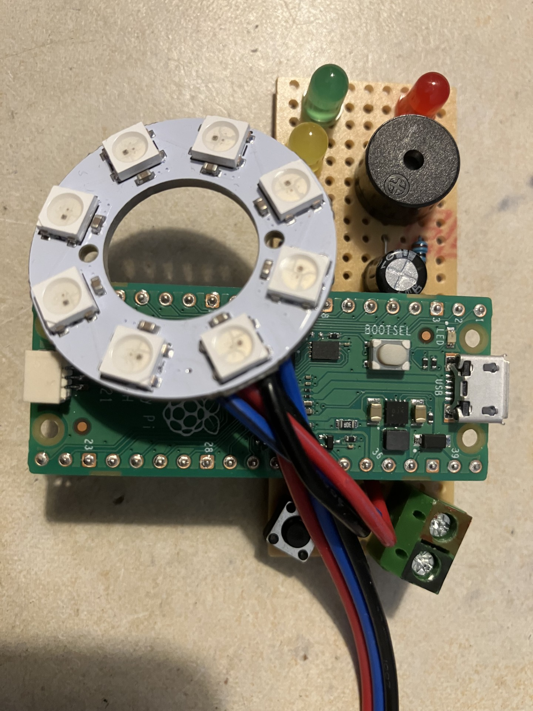
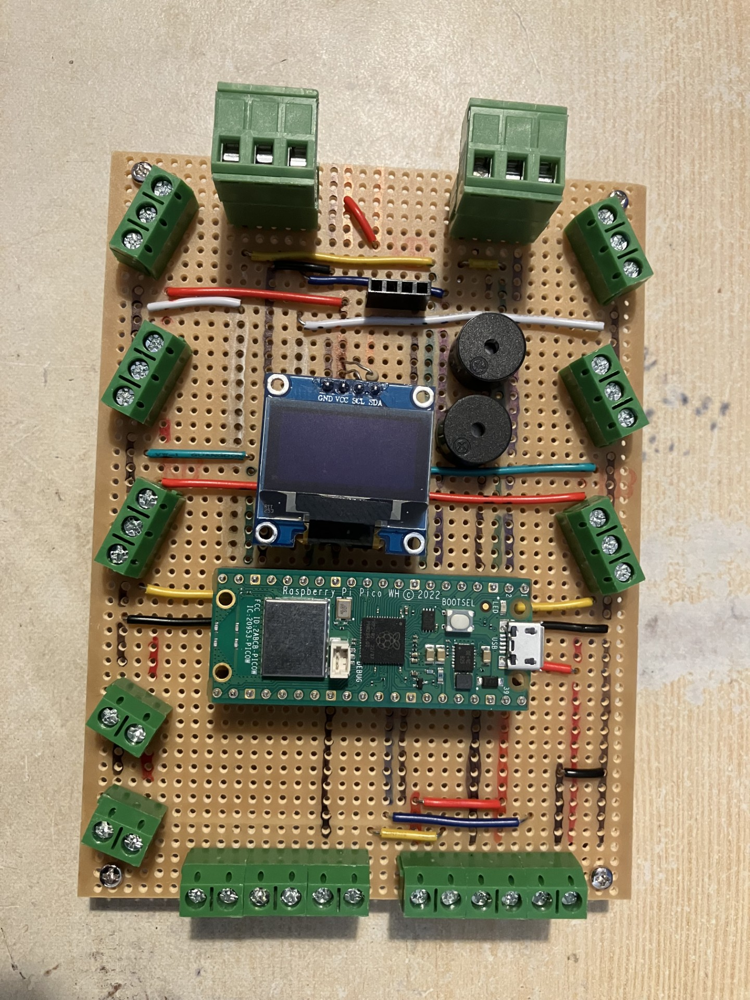
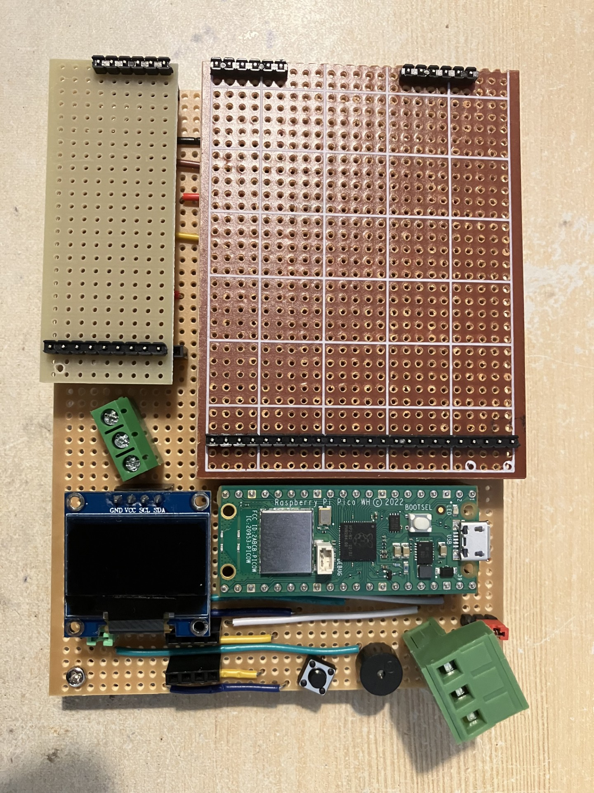
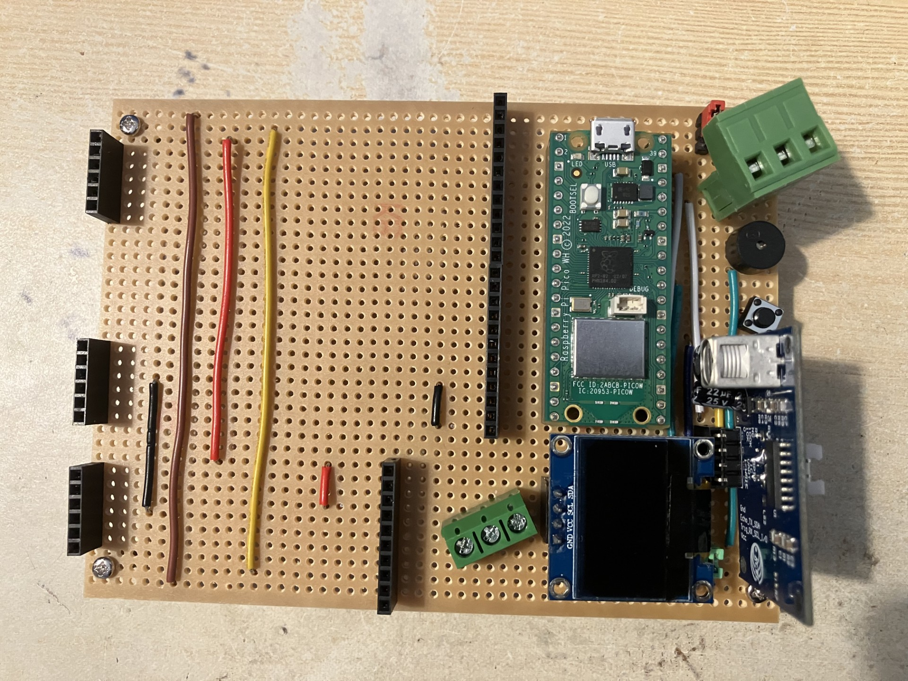

# Hardware

The reference hardware design contains the following items (all are optional):
* 1 x Supported microcontroller (Raspberry Pi Pico)
* 1 x Button
* 1 x Buzzer
* 1 x OLED display (128 x 64)
* 1 x Ultrasonic Sensor
* 1 x Network
* 1 x UART
* 1 x NeoPixel connector (input shared with audio board in reference base board)
* 1 x Audio daughter Board with 2 x ADC inputs (1 shared with NeoPixel connector)
* 1 x Custom daughter board connector

## Christmas Board

This is a very simple board that attaches to the front pins of a
Raspberry Pi Pico. It was easy to make and has NeoPixels, LEDs,
a buzzer and a button built in. This simple board is perfect for
experimenting with CircuitPython and Blinka. Whilst strictly it
does not support the full set of functionality the framework supports
as it has no OLED display nor UltraSonic connector, this functionality
can easily be added with additional connector boards and was partly
the inspiration for [Prototype Two](#prototype-two).

## Prototype One

This was the first board I built. It has two buzzers but no button.
It has two UART connectors rather than one. Also, it has 6 x NeoPixel
connectors soldered directly to the board and it breaks out 16 other
pins with the intention of them available for the audio board or
general purpose use such as for LEDs. There is an socket for the
ultrasonic sensor too. The main issue with this board was its
complexity due to trying to solve all problems with a single board.
It would also be slightly limited for future needs where I wanted
to power motors (servos could be easily connected to the NeoPixels
or other breakouts).

## Prototype two

This is the second board I built (but still a prototype). This was
designed to be as easy to make as possible, limiting the number of
track cuts and wiring. It contains all the required devices for to
offer the full functionality of the framework including a button,
buzzer, UART connector, OLED display, ultrasonic connector, NeoPixel
connector, and the stackable daughter boards. These are blanks on
this prototype. The beauty of this board is that the daughter boards
allow a single simple design of base board with the capability to
extend functionality via the daughter boards. The NeoPixel boards
will get NeoPixels connectors, the LED boards will get LED connectors
and the future motor and servo boards will get their corresponding
components and connectors.

The base board with the daughter boards removed.

